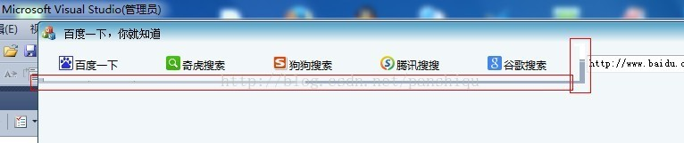
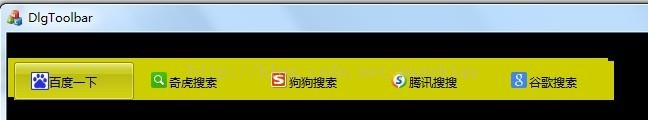

# MFC对话框如何使用工具栏并修改工具栏的背景颜色与自绘对话框统一（二）
_2013-08-29 17:27:35_

* * *

    写这篇文章只是为了解决我上一篇文章遗留的一个问题，本来觉得这个问题可以不用管，但是在我写的程序中发现并不能置之不理，先来重现这个问题

    工具栏有一部分没有绘上



    看红色框包围的地方，是背后 VS2010 的界面，因为程序擦成透明的啦，上一篇文章我错误的想成那块没有绘上上的区域是属于对话框的，也就有了我上一篇文章在 OnEaserBkgnd 和 OnPaint 画背景之分（对于我的程序）不多说这些，看我工具栏类中是怎样贴背景的

```
BOOL CToolBarEx::OnEraseBkgnd(CDC* pDC)
{
	// TODO: 在此添加消息处理程序代码和/或调用默认值
	// 填充工具栏的背景色
	CRect rectClient;
	GetClientRect(rectClient);
	pDC->FillSolidRect(rectClient, RGB(242,247,249));
	
	return TRUE;
	//return CToolBar::OnEraseBkgnd(pDC);
}
```

要解决这个问题的时候，我想偏很多地方，我分别重载 OnNcPaint 和 OnPaint ，大家也可以试试看有什么效果，这里说下 OnNcPaint 是只画和上面空白区域对应的左上方，自己添加试试就明白了，后来不行，想到GetClinetRect换成GetWindowRect（这肯定是胡乱猜的啦，也肯定不行），上面不行，反而让我想起了去看rectClient的值是什么，为什么那部分不绘，工具栏是MoveWindow出来的，大小是自己设置的，我看调试的不对应，少了一小块，我就按我自己定的大小给他填充。

```
pDC->FillSolidRect(CRect(CPoint(0, 0), CSize(612, 45))/*rectClient*/, RGB(242,247,249));
```


这样就好了，这里再来推翻一下上一篇文章中我的想法，空白区域怎么可能会是对话框上的呢，MoveWindow指定了划出这块区域给工具栏，出了问题应该首先想到工具栏呀。

说到了，这里，上一篇文章里的源码，稍微修改一下就可以重现我这篇文章所谈的问题，让对话框这样画背景

```
pDC->FillSolidRect(rectClient, RGB(0,0,0));
```



是不是这下明显多了，明显用GetClientRect取的少些什么。到此要说的就完了，算是对上一篇博文的补充吧
