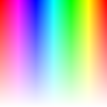

# cocos2dx如何通过Image获取指定点颜色值
_2015-05-20 14:53:12_

* * *

这个问题整整用了我一天，直到后来我在网上直接下载到了我中意的颜色图片，我的程序才真正的正确的运转起来。代码可以在这里下载：https://github.com/panshiqu/board

我现在描述一下需求，Sprite直接加载一张图片，响应点击事件，获取点击坐标值，通过Image加载该图片来获取点击的颜色值，我个人觉得理论知识就那么简单，首先感谢该篇文章的主人：http://www.cnblogs.com/jaoye/archive/2013/02/19/2916501.html，这里可以学到如何使用Image获取颜色值。

有一个问题，他在计算的时候是这样写的

```
pixel = pixel + (y * 480) + x;
```

若他是正确的，我就只能假定他是以图片的左上角为原点计算的，因为图片加载我在这里假想一下，它是从左上角那个点开始，一行一行进行加载的，我极端的举一个例子，若坐标（100，0）我们取到的肯定是图片第一行第一百像素点的颜色值。相较于正确的坐标系来讲（原点（0，0）），若图片的高度是480的话，我们真正取到像素的坐标其实是（100，480）。我只能说明到这里了，希望能看懂。

我还要再抛一个问题，0x80FFFF00是50%透明的黄色，这句话是我在别的地方看到的，应该是准确的，第一个byte位是透明度，若按照ARGB的先后顺序来理解的话，末尾的byte应该是blue，然后遗憾的是red，当我使用正确的图片资源时（下面会解释），颜色值能取对，我想方法应该是没有问题的，暂且留下这个疑问。

为什么是正确的图片资源，事先为做测试，我是通过QQ截屏截的是Windows画图程序中的选择颜色线条状的图片，无论我怎么尝试，甚至颠覆理论去理解，但是颜色总是取的不对，后来我为了减轻难度我又截屏Windows画图程序中的选择颜色方格的图片，结果依然是不行。这里我不想骂这个截屏功能，可能是因为我的无知才导致了这场悲剧的发生。

首先我上传图片资源：



接下来我贴出我的代码资源（三段代码哦）：

```
	_colorPicker = Sprite::create("ColorPickerNew.png");
	_colorPicker->setPosition(_colorPicker->getContentSize().width / 2, _colorPicker->getContentSize().height / 2);
	this->addChild(_colorPicker);

	_colorImage = new Image();
	_colorImage->initWithImageFile("ColorPickerNew.png");

bool SettingLayer::onTouchBegan(cocos2d::Touch *touch, cocos2d::Event *unused_event)
{
	Point location = touch->getLocation();
	if (_colorPicker->getBoundingBox().containsPoint(location)) {
		unsigned char *data = _colorImage->getData();
		unsigned int *pixel = (unsigned int *)data;
		pixel = pixel + (220 * (unsigned int)(220 - location.y)) + (unsigned int)location.x;
		BoardScene *runingScene = (BoardScene *)Director::getInstance()->getRunningScene();
		runingScene->setColor(*pixel);
		return true;
	}

	return false;
}

void BoardLayer::setColor(unsigned int color)
{
	GLubyte r = color & 0xff;
	GLubyte g = (color >> 8) & 0xff;
	GLubyte b = (color >> 16) & 0xff;
	GLubyte a = (color >> 24) & 0xff;
	_drawColor = Color4F(Color4B(r, g, b, a));
}
```
