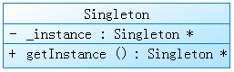

# 设计模式读书笔记：Singleton（单件模式）
_2015-06-26 14:59:50_

* * *

意图：

保证一个类仅有一个实例，并提供一个访问它的全局访问点

类图：



注意：

1.静态成员变量及静态成员方法

2.使用惰性初始化，它的返回值直到被第一次访问时才创建和保存

3.构造器是受保护的，试图直接实例化Singleton将得到一个编译时的错误信息

实现：

```
class Singleton {
public:
	virtual ~Singleton() {}
	static Singleton *getInstance(void)
	{
		if (_instance == 0)
			_instance = new Singleton();

		return _instance;
	}

protected:
	Singleton() {}

private:
	static Singleton *_instance;
};

Singleton *Singleton::_instance = 0;
```

附加：

单件模式是我目前使用最多的设计模式，所以第一个读书笔记就整理它，以前我确实如上面实现那样使用单件模式，但是创建出来的唯一实例在程序正常结束时不会调用析构，万一我想在析构里面做点什么呢？自身创建的实例当然也得不到释放。

后来我就采用这种方法啦，当然你也可以展开宏，单独实现体会返回引用的优势

```
// 单例模式宏
#define SINGLETON(classname) \
	static classname &ins(void) \
	{ \
		static classname instance; \
		return instance; \
	}
```

当然使用指针的时候，实例指针可以不作为私有静态成员变量，直接在CPP里作为静态变量，这样就不需要在类里面定义，类外声明初始化那么麻烦啦。
